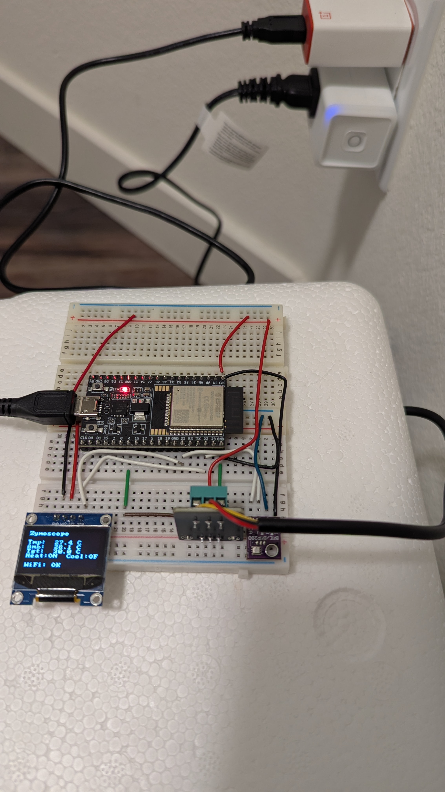

# Zymoscope

An ESP32-based fermentation monitoring and control system with a real-time web dashboard.

## Overview



Zymoscope monitors and controls fermentation environments using:

- **Temperature** sensing and PID control (DS18B20 probe + Kasa smart plug for heating/cooling)
- **Ambient climate** logging (BME280 — temperature, humidity, pressure)
- **Local display** on a 128x64 OLED for at-a-glance status
- **Wi-Fi telemetry** via MQTT to a self-hosted FastAPI + SQLite web dashboard
- **NVS-persisted setpoint** — the target temperature survives reboots; no dashboard needed to maintain control
- **Modular architecture** — ESP32 sensor nodes now, Raspberry Pi + camera later

Inspired by the [OpenAg FermentaBot](https://github.com/OpenAgricultureFoundation/fermentabot),
rebuilt from scratch with custom hardware, real sensor drivers, and a modern web frontend.

## What Can You Ferment With This?

Anything where temperature control and monitoring matter:

- **Koji** — *Aspergillus oryzae* needs 28–32 °C and high humidity for 40–48 hours.
  The PID holds your incubation chamber steady, the BME280 tracks humidity.
- **Natto** — *Bacillus subtilis* ferments at 38–42 °C for 22–24 hours.
  Tight temperature control is critical; even a few degrees off produces slimy,
  under-fermented beans.
- **Tempeh** — *Rhizopus oligosporus* sporulates at 30–32 °C over 24–48 hours.
  Too hot and the mold dies; too cold and it stalls. The dashboard shows you
  exactly when mycelium heat generation kicks in.
- **Beer / Cider / Mead** — ale yeast (18–22 °C), lager yeast (8–14 °C), or
  wild/mixed fermentation.
- **Kombucha** — SCOBY ferments best at 24–28 °C. Track progress over 7–14 days.
- **Hot Sauce** — lacto-fermented peppers at 20–24 °C.
- **Sauerkraut / Kimchi** — lacto-fermentation at 18–22 °C.
- **Yogurt / Kefir** — hold milk at 40–45 °C (yogurt) or 20–25 °C (kefir).
  The PID + smart plug keeps a heating pad at the right temperature overnight.
- **Bread / Sourdough** — proof at a controlled 24–28 °C. Bulk fermentation
  and final proof both benefit from consistent temperature.

The PID controller works with a seedling heat mat (via smart plug) for heating
and a small fan or mini fridge for cooling. One sensor node per vessel; run
multiple nodes reporting to the same dashboard.

## Architecture

```
ESP32 Sensor Node (per vessel)        Web App (laptop / Pi / server)
┌────────────────────────────┐        ┌─────────────────────────────┐
│ DS18B20 (1-Wire probe)     │  MQTT  │ FastAPI backend             │
│ BME280 (ambient)           │───────>│ SQLite storage              │
│ SSD1306 OLED (status)      │        │ WebSocket live push         │
│ PID temperature control    │<───────│ Chart.js dashboard          │
│ Kasa smart plug (via MQTT) │  cmds  │ Kasa plug control           │
└────────────────────────────┘        └─────────────────────────────┘
```

## Repository Layout

```
zymoscope/
├── firmware/                   # ESP-IDF v5.x firmware (C)
│   ├── main/
│   │   ├── app_main.c          # Entry point, FreeRTOS tasks
│   │   ├── sensor/
│   │   │   ├── ds18b20.c/h     # 1-Wire bit-bang, CRC-8, critical sections
│   │   │   ├── hx711.c/h       # 24-bit ADC bit-bang (optional)
│   │   │   └── bme280_i2c.c/h  # I2C driver, Bosch compensation formulas
│   │   ├── display/
│   │   │   └── oled.c/h        # SSD1306 128×64, built-in 8×8 font
│   │   ├── control/
│   │   │   └── pid.c/h         # PID with anti-windup, [-1,1] output
│   │   └── comms/
│   │       ├── wifi_sta.c/h    # Wi-Fi STA, auto-reconnect
│   │       └── mqtt_client.c/h # JSON telemetry + setpoint commands
│   ├── CMakeLists.txt
│   └── sdkconfig.defaults
├── dashboard/                  # Python web app
│   ├── zymoscope/
│   │   ├── server.py           # FastAPI routes + WebSocket
│   │   ├── db.py               # SQLite schema + queries (async)
│   │   ├── mqtt_sub.py         # MQTT subscriber thread
│   │   ├── smart_plug.py       # Kasa plug control + energy monitoring
│   │   └── config.py           # Environment-based settings
│   ├── templates/
│   │   └── index.html          # Dark-themed SPA, Chart.js live graphs
│   ├── mosquitto/
│   │   └── mosquitto.conf      # Local Mosquitto config
│   ├── docker-compose.yml      # Optional: Mosquitto + InfluxDB + Grafana
│   └── requirements.txt
├── hardware/                   # KiCad schematic + BOM
│   ├── zymoscope.kicad_pro
│   ├── zymoscope.kicad_sch
│   └── bom/
│       └── zymoscope-bom.csv
├── docs/
│   ├── design.md               # Full architecture + design rationale
│   ├── prototype-bom.md        # Ordering guide + wiring diagram
│   └── getting-started.md      # Step-by-step: order → build → ferment
├── .gitignore
├── LICENSE                     # GPL-3.0
└── README.md
```

## Prototype Build (~$40–55)

No custom PCB needed. Use an ESP32 dev board + breakout modules on a breadboard.

### Order from Mouser / DigiKey (~$20)

| Part | Mouser PN | Qty | ~Price |
|------|-----------|-----|--------|
| ESP32-DevKitC-32E | 356-ESP32DEVKITC32E | 1 | $10.00 |
| DS18B20 waterproof stainless steel probe | 485-381 | 1 | $10.00 |
| 4.7 kΩ resistor (1/4W) | 603-MFR-25FBF52-4K7 | 1 | $0.10 |

### Order from Amazon (~$20–35)

| Part | Search Term | Qty | ~Price |
|------|------------|-----|--------|
| TP-Link Kasa KP115 smart plug | "TP-Link Kasa KP115" | 1 | $15–20 |
| BME280 I2C breakout | "BME280 breakout I2C" (NOT BMP280) | 1 | $3–5 |
| SSD1306 0.96" OLED 128×64 | "SSD1306 0.96 I2C OLED" | 1 | $3–4 |
| Half-size breadboard | "400 tie point breadboard" | 1 | $2–3 |
| Dupont jumper wires (M-M + M-F) | "dupont jumper wire kit" | 1 | $3–4 |
| Seedling heat mat | "seedling heat mat" | 1 | $8–12 |

### Optional extras

| Part | Search Term | Notes |
|------|------------|-------|
| HX711 + 5 kg load cell kit | "HX711 load cell kit 5kg" | For gravity estimation via weight loss |
| 2-ch 5V relay module | "2 channel 5V relay module" | For direct low-voltage DC control (fans, pumps) |

See [`docs/prototype-bom.md`](docs/prototype-bom.md) for detailed part notes and
[`docs/getting-started.md`](docs/getting-started.md) for the complete step-by-step
walkthrough from ordering parts to tracking your first fermentation.

## Quick Start

### Firmware

Requires [ESP-IDF v5.x](https://docs.espressif.com/projects/esp-idf/en/stable/esp32/get-started/).

```bash
# Set your Wi-Fi credentials
# Edit firmware/main/comms/wifi_sta.h: WIFI_SSID / WIFI_PASS

# Set your MQTT broker IP
# Edit firmware/main/app_main.c: MQTT_BROKER_URI

cd firmware/
source ~/esp/esp-idf/export.sh
idf.py set-target esp32
idf.py build
idf.py -p /dev/ttyUSB0 flash monitor
```

### MQTT Broker

```bash
# Install Mosquitto (Arch Linux)
sudo pacman -S mosquitto

# Run directly with the included config
mosquitto -c dashboard/mosquitto/mosquitto.conf
```

### Web Dashboard

```bash
cd dashboard/
pip install -r requirements.txt

# Set the Kasa plug IP (find with: kasa discover)
export KASA_HEATER_HOST=192.168.1.50

python -m zymoscope.server
# Open http://localhost:8000
```

The dashboard shows per-device cards with live temperature, ambient conditions,
plug states, and 24-hour trend charts. Use the "Target Temperature" control in
the sidebar to change the PID setpoint. Data persists in SQLite.

### Set Target Temperature

From the dashboard sidebar, or via curl:

```bash
curl -X POST http://localhost:8000/api/cmd/YOUR_DEVICE_ID \
  -H "Content-Type: application/json" \
  -d '{"setpoint": 25.0}'
```

The setpoint is saved to the ESP32's NVS flash — it persists across reboots
and works even without the dashboard running.

### Docker Stack (optional)

If you want Mosquitto + InfluxDB + Grafana alongside the web app:

```bash
cd dashboard/
cp .env.example .env   # edit secrets
docker compose up -d
```

## Wiring

```
ESP32 Pin     Peripheral
─────────     ──────────────────────────────────────────
GPIO 4        DS18B20 DATA + 4.7 kΩ pull-up to 3.3V
GPIO 21       I2C SDA (BME280 @ 0x76 + OLED @ 0x3C)
GPIO 22       I2C SCL (BME280 + OLED)
3.3V          DS18B20 VCC, BME280 VCC, OLED VCC
GND           Common ground
```

**Optional (if using HX711 / relay instead of smart plug):**

```
GPIO 18       HX711 SCK
GPIO 19       HX711 DOUT
GPIO 25       Relay IN1 (heater)
GPIO 26       Relay IN2 (cooler)
5V (VIN)      Relay module VCC, HX711 VCC
```

## OLED Display

```
Zymoscope

Tmp:  24.9 C      ← DS18B20 probe (-- if disconnected)
Amb:  22.3 C      ← BME280 ambient
Tgt:  20.0 C      ← PID setpoint
Heat:OFF Cool:OFF ← Kasa plug / relay state

WiFi: OK
```

## MQTT Topics

```
zymoscope/<mac>/telemetry    # JSON, published every 30 s
zymoscope/<mac>/cmd          # Subscribe: {"setpoint": 20.0}
zymoscope/<mac>/status       # LWT: "online" / "offline"
```

## Roadmap

- [x] ESP32 sensor node firmware (DS18B20, BME280, OLED, PID, MQTT)
- [x] FastAPI web dashboard with live charts
- [x] Kasa smart plug integration (heater/cooler control + energy monitoring)
- [x] NVS-persisted setpoint (survives reboots)
- [x] Critical sections for reliable 1-Wire reads on noisy power rails
- [ ] Raspberry Pi integration + camera module (krausen tracking)
- [ ] pH probe support (analog front-end)
- [ ] OTA firmware updates
- [ ] Fermentation profile automation (diacetyl rest, crash cool)
- [ ] Custom 2-layer PCB (KiCad, JLCPCB-ready)
- [ ] 3D-printable enclosure (OpenSCAD)

## License

This project is licensed under the **GNU General Public License v3.0**.
See [LICENSE](LICENSE) for details.

Hardware design files are additionally released under
**CERN Open Hardware Licence v2 – Strongly Reciprocal (CERN-OHL-S-2.0)**.
